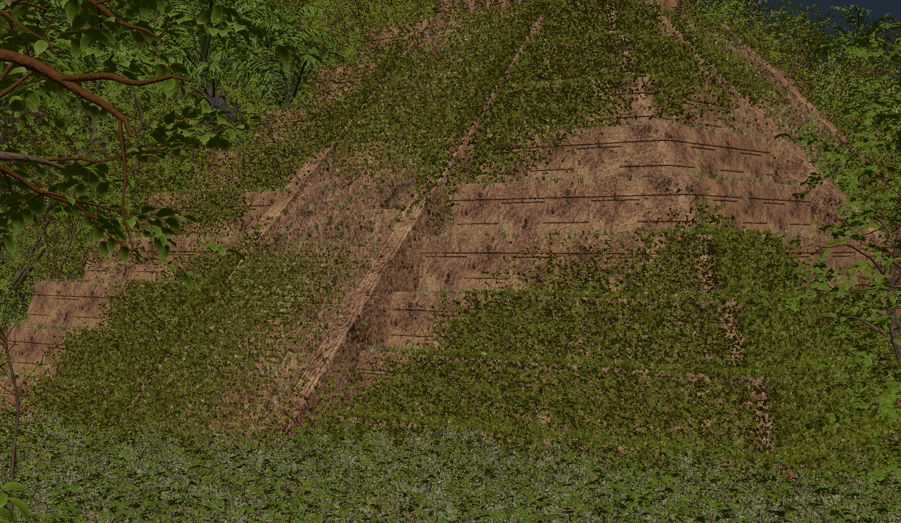
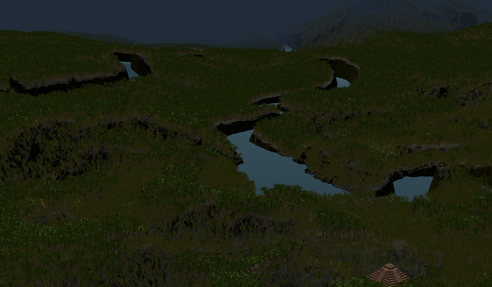
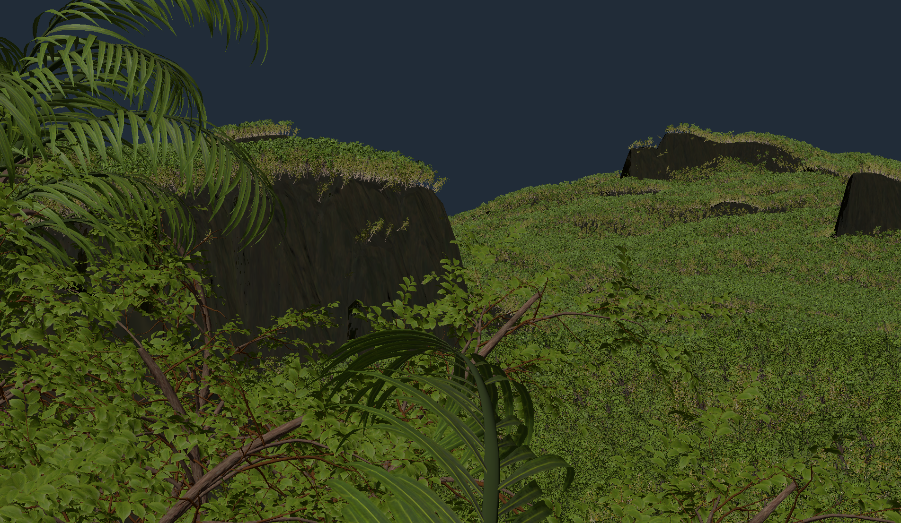
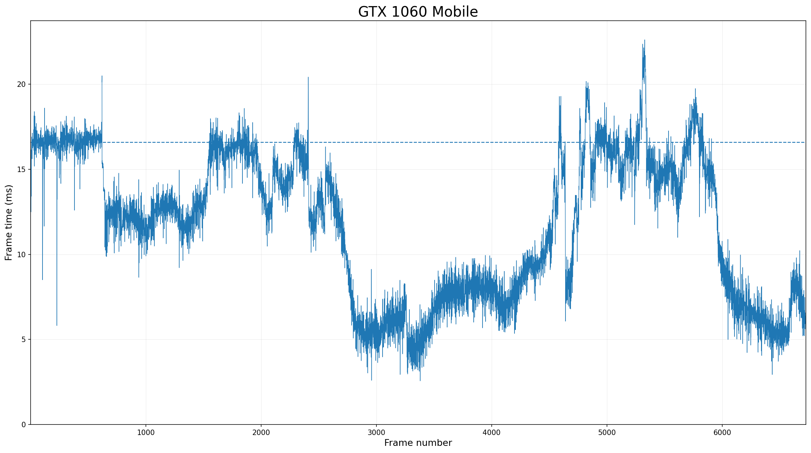
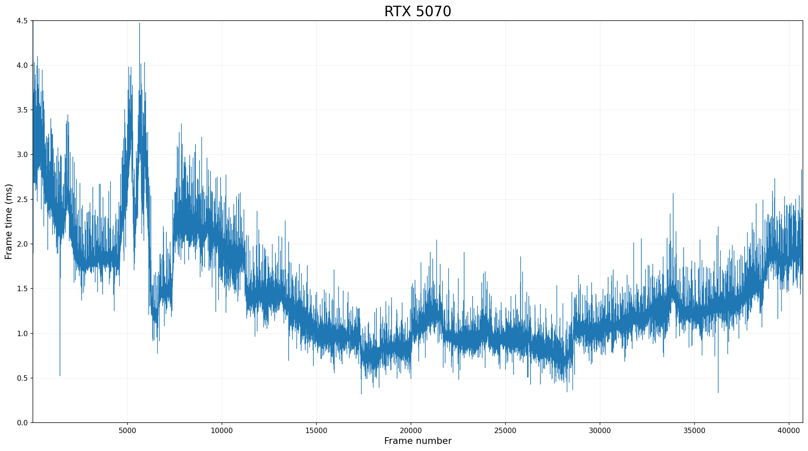

# FastJungle





FastJungle is a performance-focused D3D12 renderer for the Intel Jungle Ruins scene, prioritizing throughput and scalability over production-quality visuals.

It renders nearly 9 million instances at 1920 × 1080 and 60 FPS on an NVIDIA GeForce GTX 1060 Mobile.

To handle massive instancing, FastJungle uses offline scene cooking, GPU-driven LOD selection and culling, indirect rendering, visibility-buffer shading, and software rasterization.

FastJungle is a scene-specialized research renderer rather than a general-purpose USD renderer.

## Performance

Measured frame time in initial camera state which has high workload among the scene:
- 1060: 16.6 ms
- 5070: 3.2 ms

### NVIDIA GeForce GTX 1060 Mobile



### NVIDIA GeForce RTX 5070



## Pipeline

```text
Intel Jungle Ruins USD
  ↓ OpenUSD import
Meshes, materials, instances, and textures
  ↓ meshoptimizer LOD generation and raster clustering; texture and impostor cooking
JungleRuins.fjscene + JungleRuins.fjtex
  ↓ Runtime loading and GPU upload
Packed runtime GPU resources
  ↓ GPU culling, per-instance LOD selection, and indirect work generation
Hardware visibility rasterization + compute software rasterization
  ↓ Visibility and depth merge
  ↓ Compute resolve and PBR shading
Final frame
```

| Technique              | What it does                                                                                               |
| ---------------------- | ---------------------------------------------------------------------------------------------------------- |
| GPU-driven culling     | Rejects spatial clusters and individual instances on the GPU, eliminating per-object CPU draw preparation. |
| Screen-space LOD       | Selects one of seven mesh LODs or a directional impostor using projected geometric error.                  |
| Indirect rendering     | Generates hardware visibility draws and software-raster dispatches entirely on the GPU.                    |
| Visibility buffer      | Stores geometry IDs per pixel and shades only the final visible surface in a compute resolve pass.         |
| Software rasterization | Rasterizes distant small-triangle LODs in a compute shader and merges them with hardware depth.            |
| Offline cooking        | Precomputes LODs, raster clusters, impostors, compressed textures, and GPU-ready scene data.               |

For implementation details and design rationale, see the [Technical Overview](TECHNICAL_OVERVIEW.md).

## Requirements

* Windows x64
* MSVC toolchain with C++20 support
* CMake 3.26 or later
* Ninja
* Git
* Network access for the initial dependency downloads
* A D3D12 GPU and driver supporting Shader Model 6.6 and 64-bit integer atomics

## Scene assets

Download the Intel Jungle Ruins scene from the [Intel GPU Research Samples page](https://www.intel.com/content/www/us/en/developer/topic-technology/graphics-research/samples.html), then extract it so the repository has the following layout:

```text
assets/
├─ scene/
│  └─ JungleRuins_1_0_1b/
│     └─ USD/
│        ├─ JungleRuins_Karma.usda
│        └─ ...  # remaining Jungle Ruins files
└─ cooked/
   ├─ JungleRuins.fjscene  # generated by the cooker
   └─ JungleRuins.fjtex    # generated by the cooker
```

The imported scene source contains approximately:

* 9 million instances
* 37 million vertices
* 91 million indices
* More than 2 GB of texture data

The source assets and generated cooked files are excluded from Git.

## Build

```powershell
git clone https://github.com/chorogchip/fast-jungle-renderer.git
cd fast-jungle-renderer

# Download and extract Intel Jungle Ruins as described above.

cmake --preset cooker-release
cmake --build --preset cooker-release
.\out\build\cooker-release\bin\FastJungleCooker.exe

cmake --preset renderer-release
cmake --build --preset renderer-release
.\out\build\renderer-release\bin\FastJungle.exe
```

The initial build downloads and builds the external dependencies. After the dependencies are available, cooking the scene takes approximately 20 minutes on a modern desktop CPU.

The generated `JungleRuins.fjscene` and `JungleRuins.fjtex` files occupy approximately 4 GB in total.

## Controls

| Input        | Action            |
| ------------ | ----------------- |
| `W/A/S/D`    | Move              |
| `Space`      | Move up           |
| `Left Shift` | Move down         |
| `Ctrl`       | Move faster       |
| Arrow keys   | Rotate the camera |

## License

FastJungle's source code is licensed under the [MIT License](LICENSE).

The Intel Jungle Ruins assets are not included in this repository and remain subject to Intel's applicable asset terms. Third-party dependencies retain their respective licenses.

## Third-party software

FastJungle uses the following open-source projects:

- [OpenUSD](https://github.com/PixarAnimationStudios/OpenUSD)
- [oneTBB](https://github.com/uxlfoundation/oneTBB) — Apache-2.0
- [DirectXTex](https://github.com/microsoft/DirectXTex) — MIT
- [meshoptimizer](https://github.com/zeux/meshoptimizer) — MIT

See [THIRD_PARTY_NOTICES.md](THIRD_PARTY_NOTICES.md) for license and copyright notices.
