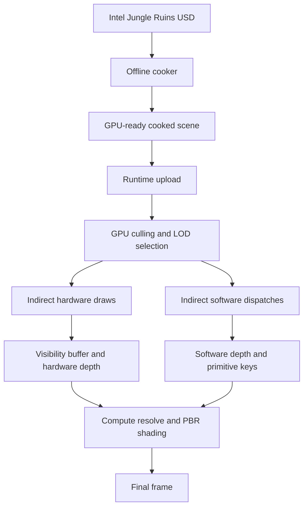

# FastJungle Technical Overview

FastJungle is a performance-focused, scene-specialized D3D12 renderer for the
Intel Jungle Ruins scene. Its primary goal is to explore throughput and
scalability for extremely large instance counts rather than production-quality
rendering.

The target workload contains approximately:

- 9 million instances
- 37 million cooked vertices
- 91 million cooked indices
- More than 2 GB of source texture data

At 1920 x 1080, the current renderer measures 16.6 ms on an NVIDIA GeForce GTX
1060 Mobile and 3.2 ms on an NVIDIA GeForce RTX 5070 in the initial,
high-workload camera state.

## Goals and scope

FastJungle is designed around a fixed, unusually dense scene. It uses that
constraint to move expensive preparation out of the frame loop and to organize
runtime data specifically for GPU-driven rendering.

The main design goals are:

- Keep per-instance visibility decisions on the GPU.
- Avoid CPU-generated draw lists and CPU readback.
- Reduce distant geometry with screen-space LODs and directional impostors.
- Shade only the final visible surface at each pixel.
- Route small-triangle workloads away from the fixed-function rasterizer when
  a compute path is more appropriate.
- Keep the complete cooked scene within the memory budget of a 6 GB GPU.

FastJungle is not a general-purpose USD renderer. Visual quality features are
intentionally limited because rendering throughput, memory use, and pipeline
experimentation are the primary objectives.

## Architecture



The CPU records the frame pipeline, but it does not build a visible-instance
list or issue one draw call per object. The GPU determines visible work,
selects geometry detail, generates indirect commands, and produces the data
consumed by the final shading pass.

## Offline scene cooking

The cooker converts the source USD scene into two runtime files:

- `JungleRuins.fjscene` contains geometry, instances, materials, bounds,
  spatial clusters, LODs, impostors, and software-raster clusters.
- `JungleRuins.fjtex` contains the cooked texture payload.

Moving this work offline reduces startup complexity and lets the cooker use
algorithms and temporary data structures that would be too expensive to run
inside the frame loop.

### USD import

OpenUSD is used to read the Jungle Ruins scene and extract the meshes,
materials, instance transforms, textures, camera, and environment data needed
by the specialized runtime representation.

### Mesh LOD generation

The cooker uses meshoptimizer to generate seven LOD levels for every eligible
mesh. Their target triangle ratios are:

| LOD | Target triangle ratio |
| --- | ---: |
| 0 | 100% |
| 1 | 50% |
| 2 | 25% |
| 3 | 12% |
| 4 | 6% |
| 5 | 3% |
| 6 | 1% |

Simplification accounts for position, normal, and UV attributes. Terrain and
pyramid meshes lock their borders during simplification to preserve important
seams and silhouettes. Lower-detail LODs receive compact vertex blocks so that
their index and vertex accesses remain local instead of repeatedly touching
the full-resolution vertex range.

Each cooked LOD stores its accumulated geometric deviation. At runtime that
deviation is projected into pixels, allowing LOD selection to use screen-space
error instead of a fixed distance threshold.

### Directional impostors

The cooker also generates directional impostor cards for supported meshes.
When an object becomes sufficiently small on screen, the GPU chooses the card
whose baked direction best matches the current view. This removes most of the
remaining geometry cost for distant, high-instance-count vegetation.

### Raster clusters

Meshoptimizer is used to partition cooked submeshes into bounded raster
clusters. Each cluster stores a compact vertex list and packed local triangle
indices. These clusters are consumed by the compute software rasterizer, where
sharing transformed vertices inside a thread group is important.

### Texture cooking and vertex packing

The cooker generates mip chains and uses block compression appropriate to the
texture type:

- BC1 for RGB-only base-color textures
- BC7 for textures that require additional channels or precision, including
  full-vector impostor normals
- BC5 for conventional two-channel normal maps
- BC4 for single-channel material textures
- BC6H for environment textures

Runtime vertex streams are split by use and packed to reduce bandwidth.
Positions and UVs use 16-bit normalized components, while normals use packed
10-bit components. The visibility pass can therefore read a much smaller
stream than the later material resolve pass.

## GPU-driven culling and work generation

The runtime culling pipeline is implemented as a sequence of compute passes:

```text
Clear -> Cull and count -> Prefix scan -> Scatter -> Build indirect work
```

The output is a compact visible-instance list plus indirect commands for both
hardware and software rasterization. No visibility result is copied back to
the CPU.

### Hierarchical frustum culling

Instances are spatially ordered and grouped into clusters during scene
preparation. Runtime culling first tests the bounding sphere of each spatial
cluster against the camera frustum. If the cluster is rejected, none of its
instances require further work.

For a surviving cluster, each instance is tested again using its transformed
mesh bounding sphere. This two-level test keeps dense, off-screen regions from
turning into millions of independent visibility operations.

### Screen-space LOD selection

For each surviving instance, the GPU projects the error of the next LOD into
pixels. It advances to a coarser LOD while the projected error remains below
the configured threshold.

After reaching the conventional mesh LOD range, the same projected size is
used to:

- Select a directional impostor for a sufficiently distant object.
- Cull an object that has become too small to contribute meaningfully to the
  frame.

This keeps the selection stable across meshes with different world-space
sizes and bounds the visible geometric error in image space.

### Count, scan, and scatter

Visible instances are grouped into bins by mesh LOD:

1. `CullCount` performs cluster and instance tests, selects each surviving
   instance's mesh LOD, and counts results per bin.
2. `BinScan` computes the prefix sum of bin counts and produces compact output
   offsets.
3. `CullScatter` writes instance IDs into the final visible-instance list.
4. `BuildIndirect` creates rendering commands from the populated bins.

The count pass uses group-local reservations before updating global bin counts,
reducing the number of global atomic operations generated by dense clusters.

### Indirect rendering

`BuildIndirect` separates work by raster class, including pyramid, terrain,
opaque, river, and alpha-tested geometry. It writes one of two command types:

- Indexed indirect draws for fixed-function hardware rasterization.
- Indirect compute dispatches for software-raster batches.

Both command streams are consumed with `ExecuteIndirect`. The CPU does not
need to know how many instances survived, which LOD was chosen, or how many
draws and dispatches the GPU generated.

## Visibility-buffer rendering

FastJungle separates visibility determination from material shading. The
hardware raster pass writes geometry identity rather than a fully shaded
color.

The visibility target uses `R32G32_UINT`, or 64 bits per pixel. A record packs:

| Field | Bits |
| --- | ---: |
| Triangle ID | 22 |
| Submesh ID | 11 |
| Instance ID | 30 |
| Back-face flag | 1 |

Opaque geometry only needs position data during visibility rendering.
Alpha-tested geometry additionally carries UVs so that it can sample opacity
before writing a visibility record. Expensive material attributes are not
interpolated or shaded until the final visible primitive is known.

This design reduces three kinds of wasted work:

- Material shading for fragments later rejected by depth.
- Attribute fetch and interpolation for hidden geometry.
- Overdraw and pixel-quad shading that does not contribute to the final image.

The effectiveness is hardware-dependent. In a development comparison on the
GTX 1060 Mobile, the measured forward path decreased from 29 ms to 19 ms after
switching to the visibility-buffer path. On the RTX 5070, the same comparison
changed from 6.5 ms to 7.0 ms because the resolve overhead outweighed the saved
work. These measurements describe that isolated development comparison, not
the current complete-frame benchmark.

## Compute software rasterization

The lower-detail mesh LODs contain many small triangles. FastJungle can route
eligible LOD 4 and later geometry to a compute rasterizer instead of issuing a
hardware draw.

The GPU-generated software batch identifies a visible-instance range, a
submesh, and a range of raster clusters. `ExecuteIndirect` turns the batch into
a two-dimensional compute dispatch over instances and clusters.

Within each thread group, the software rasterizer:

1. Loads the instance transform, submesh, decode parameters, and raster
   cluster once.
2. Transforms cluster vertices and stores raster-space positions in group
   shared memory.
3. Processes packed cluster triangles with edge equations and the top-left
   fill convention.
4. Visits the covered pixel bounding box and evaluates interpolated depth.
5. Writes a 64-bit key containing depth and primitive identity with an atomic
   minimum operation.

The software path does not shade materials. Its output only identifies the
closest software-rasterized primitive at each pixel, matching the deferred
nature of the hardware visibility path.

## Hardware and software merge

Hardware rasterization produces the visibility buffer and a D32 depth target.
Software rasterization produces a 64-bit depth-and-primitive key buffer. The
resolve shader examines both representations at each pixel and selects the
closer result.

This merge allows large triangles to stay on the efficient fixed-function
rasterizer while distant small-triangle work moves to compute. Both paths then
share the same attribute reconstruction, texture sampling, and material
shading implementation.

## Compute resolve and shading

The full-screen resolve pass translates the winning visibility result into the
final pixel color. It:

- Locates the instance, submesh, and source triangle.
- Reconstructs triangle positions and packed shading attributes.
- Calculates screen-space barycentric coordinates.
- Derives analytic position and UV gradients for texture sampling.
- Decodes packed normals and UVs.
- Samples material textures through non-uniform resource indexing.
- Applies normal mapping and PBR shading.

Because resolve runs only for the winning surface, the cost of full material
evaluation is mostly independent of geometric overdraw.

## Memory strategy

The source scene cannot be loaded naively within the target GPU's memory
budget. FastJungle combines several techniques to control memory use:

- Block-compressed textures with complete mip chains.
- Packed, purpose-specific vertex streams.
- Compact vertex storage for lower LODs.
- A bounded, double-buffered upload path instead of one persistent upload
  buffer per texture.
- Serialized GPU-ready scene and texture payloads.

The generated scene consists of approximately 2.07 GiB of geometry data and
1.95 GiB of texture data, or about 4 GiB in total on disk.

## Current limitations

- The importer and cooked representation are specialized for Intel Jungle
  Ruins rather than arbitrary USD content.
- Frustum, projected-size, and LOD culling are implemented; Hi-Z occlusion
  culling is not currently part of the frame pipeline.
- The renderer targets D3D12 Shader Model 6.6 and requires 64-bit integer
  atomics for the software-raster key buffer.
- The project emphasizes performance experimentation over production rendering
  quality and feature completeness.

## Source map

| Area | Main implementation files |
| --- | --- |
| LOD cooking | `src/cooker/MeshLodBuilder.cpp` |
| Impostor cooking | `src/cooker/ImpostorBuilder.cpp` |
| Raster-cluster cooking | `src/cooker/RasterClusterBuilder.cpp` |
| Texture cooking | `src/cooker/TextureBuilder.cpp`, `src/cooker/TextureCompressionPolicy.cpp` |
| GPU culling | `src/renderer/pass/PassGPUCull.cpp`, `shaders/culling/` |
| Hardware visibility | `src/renderer/pass/PassVisibility.cpp`, `shaders/visibility/Visibility*.hlsl` |
| Software rasterization | `src/renderer/pass/PassSWRaster.cpp`, `shaders/raster/` |
| Resolve and shading | `src/renderer/pass/PassResolve.cpp`, `shaders/visibility/ResolveOpaque.cs.hlsl` |
