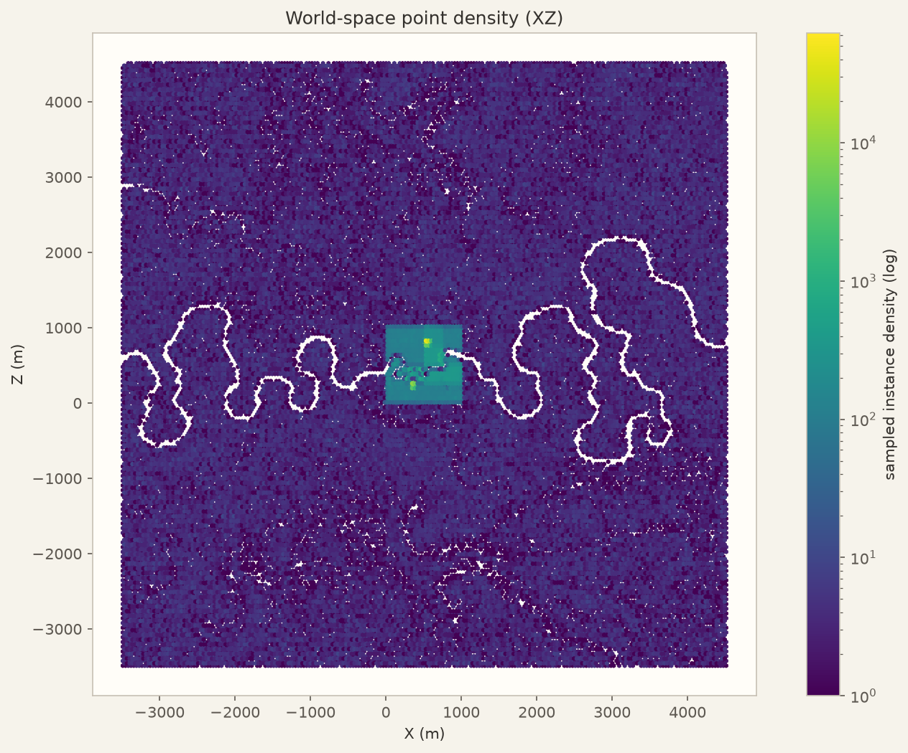
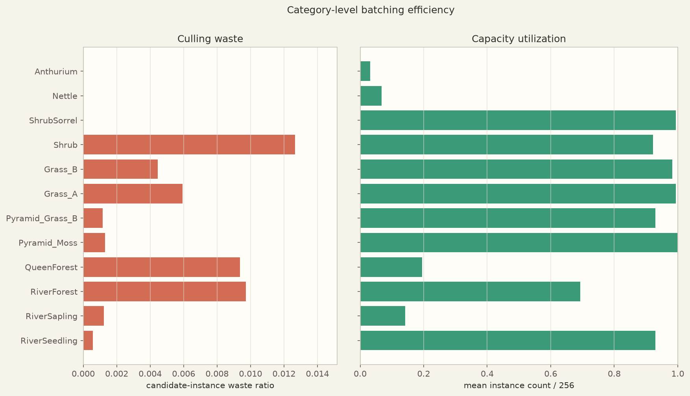
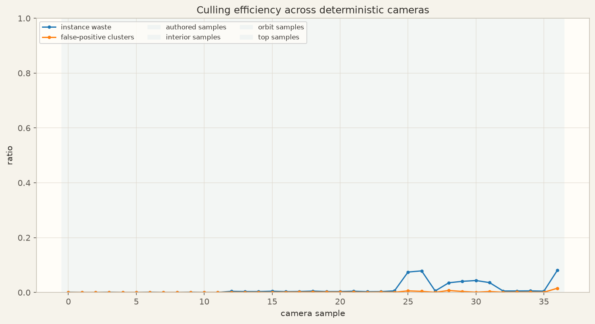
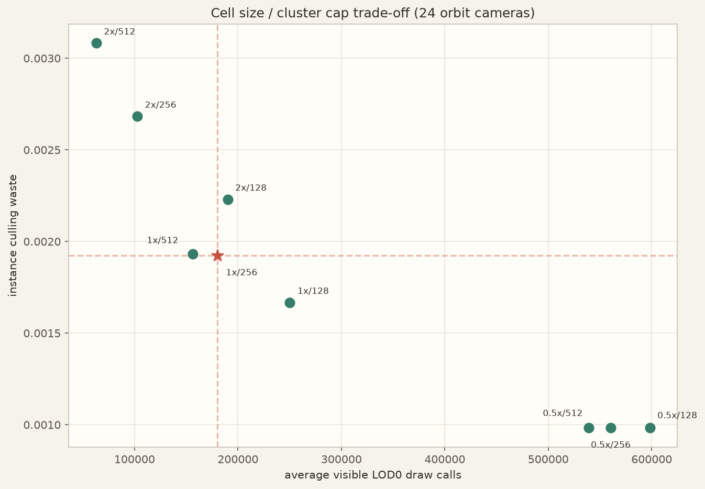

# FastJungle spatial batch audit

Remote commit `a482212`, Release-cooked FJSCENE v8 기준 공간 배치 감사 결과입니다.

| Metric | Result |
|---|---:|
| Point instances | 8,674,676 |
| Source PointBatch | 58 |
| Runtime PointCluster | 49,771 |
| Mean cluster occupancy | 68.1% |
| Deterministic cameras | 37 |
| Aggregate candidate-instance waste | 0.4% |
| All correctness invariants passed | True |

현재 `1.0x cell / cap 256`은 24개 orbit sample에서 평균 LOD0 draw 179,925개와 instance waste 0.2%를 기록했습니다. 제한된 sweep의 균형 점수 최저는 `2x / 512`입니다. 가장 큰 category waste는 **Shrub (1.3%)**였습니다.

> 이 값은 transformed instance AABB를 actual visibility 대용으로 사용한 보수적 진단입니다. LOD 효과를 분리하기 위해 draw/triangle workload는 LOD0 기준입니다.

## Overview

## Files

- [Interactive-style HTML report](report/index.html)
- [Summary JSON](summary.json)
- [Methodology](methodology.md)
- [Cluster metrics](raw/cluster_metrics.csv)
- [Source batch metrics](raw/source_batch_metrics.csv)
- [Category summary](raw/category_summary.csv)
- [Camera metrics](raw/camera_metrics.csv)
- [Configuration sweep](raw/configuration_sweep.csv)
- [Worst-cluster detail images](details/)
- [Python audit generator](scripts/generate_spatial_batch_audit.py)
- [Temporary cooker stack-overflow fix](patches/texture-hash-stack-overflow.patch)
- [Release cook verification summary](raw/cook_verification.txt)
